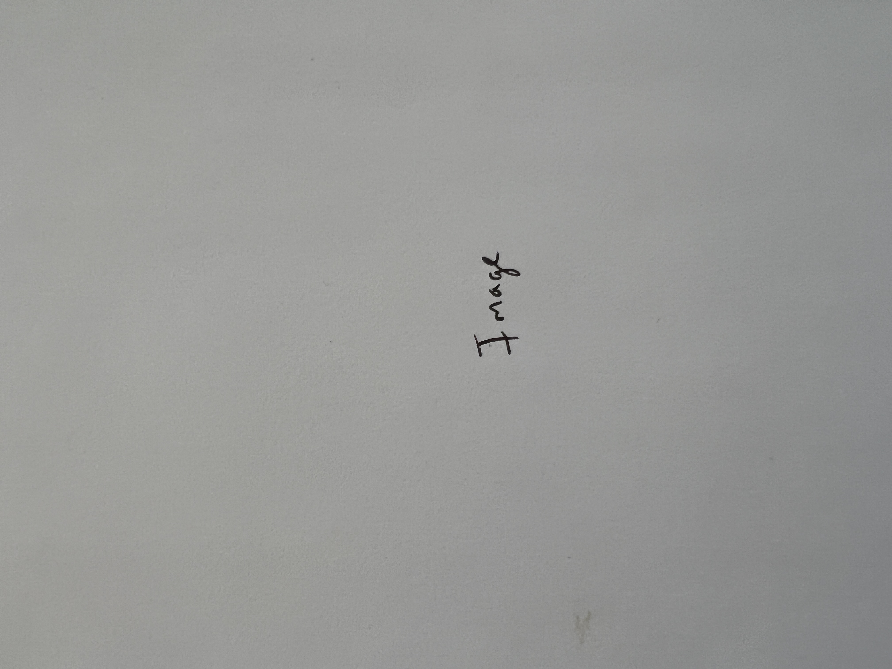
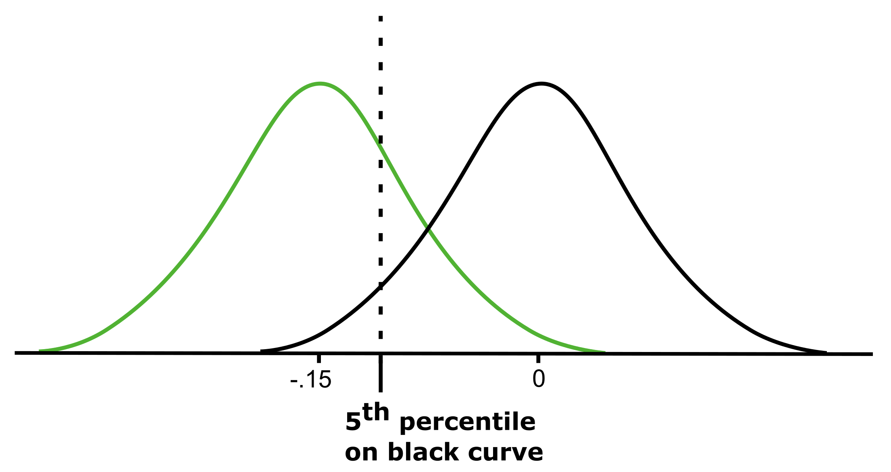
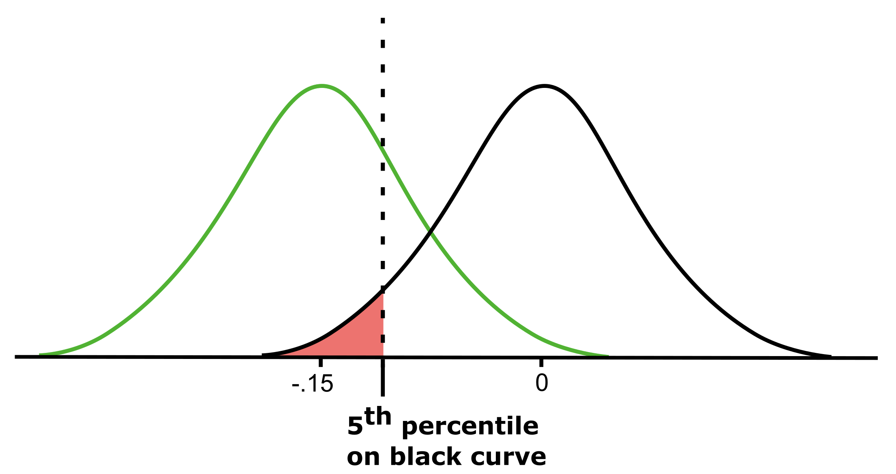
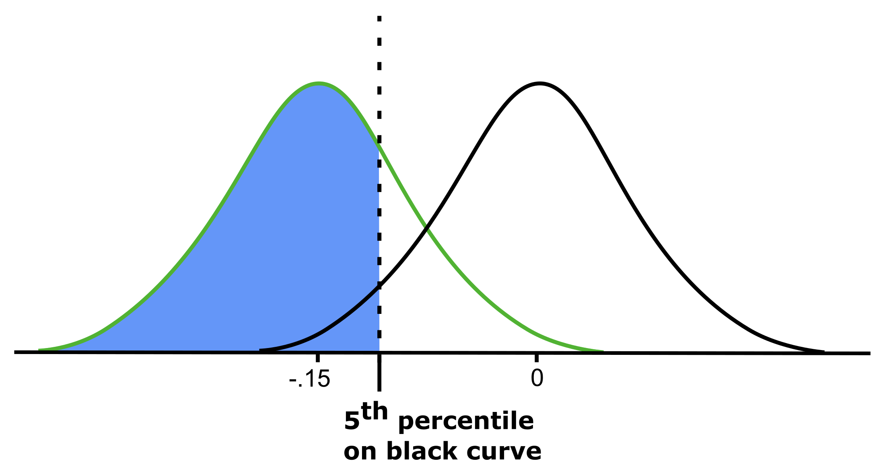
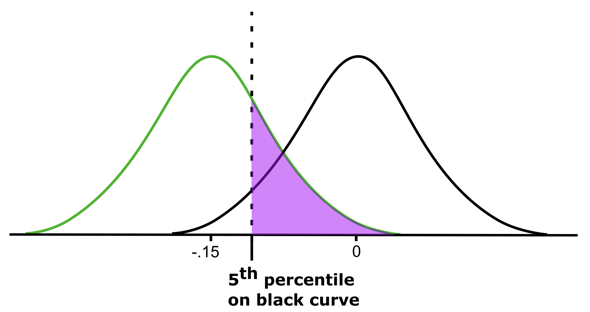
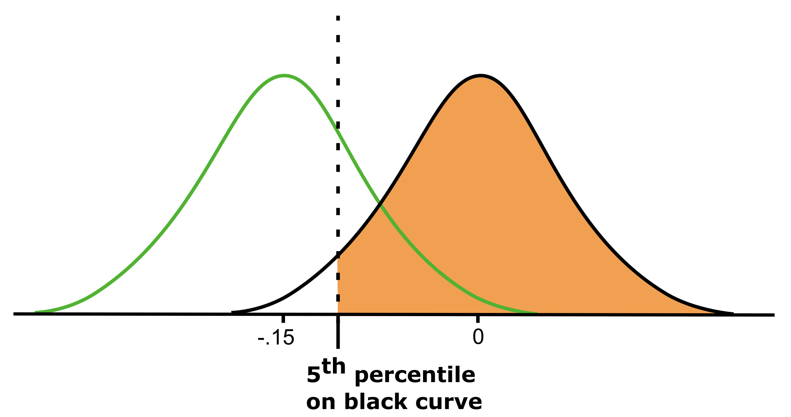

```{r global_options, include = FALSE}
library(knitr)
knitr::opts_chunk$set(eval = TRUE, results = TRUE)
```

### Instructions

+ This is the take home midterm due on Tuesday, April 16, at 11:59 pm.

+ There are 25 possible points on this assignment.

+ This midterm should take you 2-3 hours to complete. Do NOT exceed 6 hours of working on the exam. You may work on the exam at various points between now and the due date but the total time cannot exceed 6 hours. 

+ **Rules:**

  - You are allowed to use any course materials on this midterm. This includes the course texts, previous worksheets, and previous labs.

  - You should not be using google or any other website at any point during this exam. 
  - If you are having trouble using `R` (graphing, for example), look through old worksheets and labs for example code. You will not be asked to do anything in `R` that you have not done before. 
  - You are not permitted to speak with any one other than me about the midterm till after the due date. (Even if you finish early, don't talk to your class mates about it since they might not be finished).
  - Please attempt the exam early so that we can fix any knitting issues before the due date. Your midterm will not be accepted if it does not knit.

+ Answer `R` questions by writing code where you are asked to `## insert code here`
+ Answer written questions in the space provided where it says "Write your answer here".
+ All answers have a code chunk section but you may not always need to use the code chunks. 
+ **Written answers need to be in complete sentences.**
+ **You need to show your work or `R` code for any calculations.**


---

#### **TIP 1:** Don't forget to verify the conditions needed to apply our methods to any applicable problems!

#### **TIP 2:** Show lots of work and explain what you are doing in your code. I can give more partial credit if you have the right idea even if the code is not correct.

---

##### **Exercise 1. A microwave popcorn company uses a machine to add butter to each bag of popcorn. The amount of butter added to the bags is approximately normally distributed. The machine adds an average of $120$ grams of butter with a standard deviation of $2$ gram.** 

**(A.) A bag of popcorn is randomly selected from the bags produced by the machine and the amount of butter in the bag is measured. **

(i.) Draw a graph that represents the sampling distribution for the sample statistic. Include the following three features in your graph (1 point):

+ A title that indicates the type of sampling distribution and standard error for the sample statistic.
+ indicate the value at the center of the distribution on the $x$-axis
+ shade the region of the graph that represents the probability that the amount of butter added to the bag is between $119$ and $121$ grams

<center>

</center>

(ii.) Now use `R` code to determine the probability that the amount of butter added to the bag is between $119$ and $121$ grams. Report your result from the code in a complete sentence (1 point).

```{r}
# insert any code needed here
```

<div>
:::{#answer}

Write your answer here

:::
</div> 

 
**(B.) $10$ bags of popcorn are randomly selected from the bags produced by the machine and the average amount of butter in the bags is measured.**

(i.) Provide a range of values such that there is a $90 \%$ probability that the average amount of butter in the sample will fall within that range. Write your answer in a complete sentence (1 point).

```{r}
# insert any code needed here
```

<div>
:::{#answer}

Write your answer here

:::
</div> 


(ii.) What is the probability that the average amount of butter in the sample is larger than $123$ grams? Write your answer in a complete sentence (1 point).

```{r}
# insert any code needed here
```

<div>
:::{#answer}

Write your answer here

:::
</div> 

(iii.) Without doing any calculations, if the sample size is increased to $1000$ bags of popcorn does the probability that you found in the previous part increase, decrease, or remain the same? Make sure to explain your reasoning. (1 point).

<div>
:::{#answer}

Write your answer here

:::
</div> 

---

##### **Exercise 2. A study suggests that the average college student spends $8$ hours per week studying. From your experience, you think students at Davidson study more than that. To test your hypothesis you randomly sample $50$ Davidson students and find that on average they spent $12.25$ hours a week studying. A friend of yours, who offers to help you with the hypothesis test, comes up with the following set of hypotheses. Indicate any errors you see. In addition to describing the errors you see, provide correct hypotheses for the test. (1 point)**

$H_0: p < 8$ hours

$H_A: p > 12.25$ hours


<div>
:::{#answer}

Write your answer here in a complete sentence

$H_0:$

$H_A:$

:::
</div>

---

##### **Exercise 3. Before conducting an experiment it is important to consider the impact of different error types. Consider the hypotheses given below. Describe within the context of the hypotheses what a Type I and Type II error are. Which error type is more important to minimize in this situation?   (1 point)**

$H_0:$ Airplane flights are not dangerous 

$H_A:$ Airplane flights are dangerous 


<div>
:::{#answer}

Type I error: 

Type II error: 

Answer which one to minimize here.

:::
</div>

---

##### **Exercise 4. While watching the news you hear a reporter say that the majority of Americans do not support off-shore drilling. You are skeptical of their claim so you decide  to do your own research. After a quick google search you find a national survey conducted using a simple random sample of $1200$ adults found that $624$ Americans support off-shore drilling. Set up a hypothesis test to determine if the survey provides statistically significant evidence that the true proportion of Americans that support off-shore drilling is larger than $50 \%$ using a $5 \%$ significance level.**

(A.) Set up the hypotheses below (1 point):

<div>
:::{#answer}
$H_0:$

$H_A:$
:::
</div>

(B.) Assuming the null hypothesis is true, draw a graph that represents the sampling distribution for the sample statistic. Include the following four features in your graph (1 point):

+ A title that indicates the type of sampling distribution and standard error for the sample statistic.
+ indicate the value at the center of the distribution on the $x$-axis 
+ indicate the approximate location of the sample statistic
+ shade the region of the graph that represents the $p$-value of the sample statistic

<center>

</center>

(C.) Conduct a hypothesis test to obtain a $p$-value for the sample statistic or explain why our methods do not apply. (2 point)

```{r}
# insert code here
```

(D.) Write the conclusion from your hypothesis test within the context of the problem. (1 point)

<div>
:::{#answer}
Answer here
:::
</div>

---

##### **Exercise 5. A study categorizes students as heavy drinkers if they have $5$ or more drinks on a typical drinking day and wants to compare the average GPA between students that are heavy drinkers and those that are not. The standard deviation of students' GPA is well known in the school to be $0.42$ points and there is no reason to believe the standard deviation is different for the two groups. A survey is done using methods that ensure independence and it finds that the $72$ students that identify as heavy drinkers have an average GPA of $2.86$ and the $158$ students that do not identify as heavy drinkers have an average GPA of $2.98$. Use a significance level of $.05$ to determine if there is statistically significant evidence that the average GPA of heavy drinkers is lower than the other group.**

(A.) Let $\mu_D$ represent the average GPA of the heavy drinkers and $\mu_N$ the average GPA for the other group. Given the following null hypothesis, what should the alternate hypothesis be? (1 point):

<div>
:::{#answer}
$H_0: \mu_D - \mu_N \geq 0$

$H_A:$
:::
</div>

(B.) Assuming the null hypothesis is true, draw a graph that represents the sampling distribution for the sample statistic. Include the following four features in your graph (1 point):

+ A title that indicates the type of sampling distribution and standard error for the sample statistic.
+ indicate the value at the center of the distribution on the $x$-axis 
+ indicate the approximate location of the sample statistic
+ shade the region of the graph that represents the $p$-value of the sample statistic

<center>

</center>

(C.) Conduct a hypothesis test to obtain a $p$-value for the sample statistic or explain why our methods do not apply. (2 point)

```{r}
# insert code here
```

(D.) Write the conclusion from your hypothesis test within the context of the problem. (1 point)

<div>
:::{#answer}
Answer here
:::
</div>

(E.) If heavy drinkers have GPAs that are on average $.15$ points lower than the other group, the college will take action to provide additional academic assistance to students that are heavy drinkers. What is the power of the hypothesis test at detecting this difference? A partial picture is provided for reference. (1 point)

<center>

</center>

```{r}
# insert code here
```

(F.) There are four shaded areas below. Match the shaded area with what it represents in the context of the problem. (1 point)

<center>


</center>
<center>


</center>

<div>
:::{#answer}
The options are: 

+ probability that we fail to reject the null hypothesis given that it is true.
+ power.
+ probability of a type I error. 
+ probability of a type II error. 


Red area (top-left): 

Blue area (top-right):

Green area (bottom-left):

Orange area (bottom-right):
:::
</div>

##### **Exercise 6. A quality control manager at a ketchup company takes a simple random sample of $16$ packets of ketchup. They know that the population distribution of ketchup packet weights is normal. From the sample of $16$ packets the manager finds a mean of $2$ ounces and a standard deviation of $0.1$ ounces. **

(A.) Construct a $90 \%$ confidence interval for the true population mean or explain why our methods do not apply (2 point):

```{r}
# insert code here
```

(B.) Which of the following options best describes the meaning of the confidence interval (1 point):

|   (a.) $90 \%$ of confidence intervals constructed in this way will contain the true population mean.

|   (b.) $90 \%$ of the time the sample mean will be contained in the confidence interval.

|   (c.) There is a $90 \%$ chance that the true population mean is the confidence interval.

|   (d.) $90 \%$ of samples will have a mean contained in the confidence interval.

<div>
:::{#answe}
Answer here
:::
</div>

(C.) The employees claim that, although there is some variation in ketchup packet weights the packets almost never drop below $1.95$ ounces. Does the confidence interval you found support their claim? (1 point)

<div>
:::{#answe}
Answer here
:::
</div>

##### **Exercise 7. In a national poll of $600$ randomly sampled Americans consisting of $348$ men and $252$ women were asked if they felt valued at their jobs. The results found that $152$ men and $115$ women felt valued at their jobs. Find a $95 \%$ confidence interval for the difference between the proportions of men and women that feel valued at their jobs. (2 points)**

```{r}
# insert code here
```

