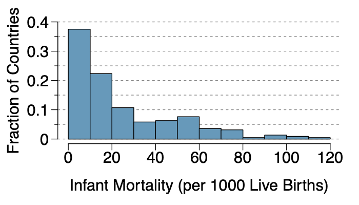

```{r global_options, include = FALSE}
library(knitr)
knitr::opts_chunk$set(eval = TRUE, results = TRUE)
```

### Instructions

+ This is the take home midterm due on Saturday, March 2nd, at 9:00 pm.

+ There are 25 possible points on this assignment.

+ This midterm should take you 2-3 hours to complete. Do NOT exceed 6 hours of working on the exam. You may work on the exam at various points between now and the due date but the total time cannot exceed 6 hours. 

+ **Rules:**

  - You are allowed to use any course materials on this midterm. This includes the course texts, previous worksheets, and previous labs.

  - You should not be using google or any other website at any point during this exam. 
  - If you are having trouble using `R` (graphing, for example), look through old worksheets and labs for example code. You will not be asked to do anything in `R` that you have not done before. 
  - You are not permitted to speak with any one other than me about the midterm till after the due date. (Even if you finish early, don't talk to your class mates about it since they might not be finished).
  - Please attempt the exam early so that we can fix any knitting issues before the due date. Your midterm will not be accepted if it does not knit.

+ Answer `R` questions by writing code where you are asked to `## insert code here`
+ Answer written questions in the space provided where it says "Write your answer here".
+ All answers have a code chunk section but you may not always need to use the code chunks. 
+ **Written answers need to be in complete sentences.**
+ **You need to show your work or `R` code for any calculations.**


---

##### **Exercise 1. Load the `tidyverse` and `openintro` packages. Additionally, save the `county` data from openintro locally as `county`. (0.2) points**

```{r}
## insert code here
```


---

##### **Exercise 2. How many rows and columns are in the `county` data set (REMINDER: answer in complete sentences)? (0.2) points**

```{r}
## insert code here
```

<div>
:::{#answer}

Write your answer here

:::
</div>  

---

##### **Exercise 3. View the documentation for the `county` data. What does the column `multi_unit` mean?  (0.2) points**

```{r}
## insert code here
```

<div>
:::{#answer}

Write your answer here

:::
</div> 

---

##### **Exercise 4. Using the `county` data set provide one example of each of the four variable types.  (0.4) points**

<div>
:::{#answer}

categorical nominal: 

categorical ordinal:

numeric discrete:

numeric continuous:

:::
</div> 


---

##### **Exercise 5. In the `county` data set, counties with a higher percentage of the population in poverty have smaller median household incomes. Provide a graph that shows this relationship. (1) points**

```{r}
## insert code here
```

 
---

##### **Exercise 6. (A.) Create a histogram of the population change across the counties from 2010 to 2017. Choose an appropriate bin width for your histogram, add a title, and label the axes appropriately. (B.) What is the mean, median, IQR, variance, and standard deviation of population change? (you may use built in `R` functions for this) (2.5) points**

```{r}
## insert code here
```

<div>
:::{#answer}

mean $=$

median $=$

IQR $=$

variance $=$

standard deviation $=$

:::
</div>


---

##### **Exercise 7. (A.) Create a new data set that only contains counties in North Carolina. (B.) How many rows and columns are in this data set? (.5) points**

```{r}
## insert code here
```

<div>
:::{#answer}

(B.) Write your answer here

:::
</div> 

---

##### **Exercise 8. Plot a scatterplot with homeownership rate on one axis and percent of population in poverty on the other axis. What does this plot tell you about trends or relationships in the data?  (1.5) points**

```{r}
## insert code here
```

<div>
:::{#answer}

Write your answer here

:::
</div> 

---

##### **Exercise 9. Add color to your scatter plot from the previous exercise based on median education level.  What does this plot tell you about trends or relationships in the data? (1.5) points**

```{r}
## insert code here
```

<div>
:::{#answer}

Write your answer here

:::
</div> 

---

##### **Exercise 10. A recent article in a college newspaper stated that college students get an average of 5.5 hrs of sleep each night. A student who was skeptical about this value decided to conduct a survey by randomly sampling 25 students. On average, the sampled students slept 6.25 hours per night. Identify which value represents the sample mean and which value represents the claimed population mean. (0.5) points**

<div>
:::{#answer}

Write your answer here

:::
</div> 

---

##### **Exercise 11. Multiple Choice. A professor states that a majority of her students scored above the mean on her last exam. This means which of the following: (1) points**

  **A. The professor is crazy because this is not possible.** <br>
  **B. The distribution of scores was right-skewed.** <br>
  **C. The distribution of scores was left-skewed.** <br>
  **D. the distribution of scores was symmetric.** <br>
  **E. The distribution of scores was uniform.** <br>
  
**Explain why you chose the answer that you did**

<div>
:::{#answer}

Write your answer here

:::
</div> 


---

##### **Exercise 12. Multiple Choice. A professor gives a test to 140 students and determines the median score. After grading the test, she realizes that the 5 students with the highest scores did exceptionally well. She decides to award these 5 students a bonus of 10 more points. The median of the new score distribution will be ______ that of the original score distribution. (1) points**

**A. Lower than** <br>
**B. equal to** <br>
**C. higher than** <br>
**D. Depending on skewness, higher or lower than** <br>
**E. Depending on modality, higher or lower than** <br>

**Explain why you chose the answer that you did**

<div>
:::{#answer}

Write your answer here

:::
</div> 

---

##### **Exercise 13. I always go to Summit coffee shop to perform one of three activities: $50 \%$ of my visits are to grade for this class, $40 \%$ of the visits I will read a novel, and $10 \%$ of the visits I will play chess. Since Davidson is a small town, I will often be interrupted by someone I know. If I am grading, there is a $75 \%$ chance someone will interrupt me. If I am reading a novel, there is only a $10 \%$ chance someone will interrupt me. Below is a tree diagram representing the events with various missing values. Answer the questions below about the tree diagram: (show all work) (3 points)**

<center>

</center>

**A. What value should go in the box with an asterisk next to it?** <br>
**B. What is $P(\text{not interrupted }| \text{ reading})$ ?** <br>
**C. What is $P(\text{grading and interrupted})$ ?** <br>
**D. If, in addition, you know that the probability that I am interrupted and playing chess is $.08$. What is $P(\text{interrupted }| \text{ chess})$?**<br>


<div>
:::{#answer}

(A.) Write your answer here

(B.) Write your answer here

(C.) Write your answer here

(D.) Write your answer here

:::
</div> 

---

##### **Exercise 14. Three data sets are represent below with both a histogram and a boxplot. Match each histogram with the box plot that represents the same data set. (1) points **

<center>

</center>


<div>
:::{#answer}

Histogram (a.) matches with box plot ___

Histogram (b.) matches with box plot ___

Histogram (c.) matches with box plot ___

:::
</div> 

---

##### **Exercise 15. The infant mortality rate is defined as the number of infant deaths per 1,000 live births. This rate is often used as an indicator of the level of health in a country. The relative frequency histogram below shows the distribution of estimated infant death rates for 224 countries for which such data were available in 2014.  Estimate Q1, the median, and Q3 from the histogram. (1.5) points**

<center>

</center>


<div>
:::{#answer}

$Q_1=$

median $=$

$Q_3=$

:::
</div> 

---

##### **Exercise 16. Suppose there is a disease that is  occurs in $27.2 \%$ of a country’s population. There is a test that is $99.4 \%$ accurate for those who have the disease. For those who do not have the disease, the test is $92.1 \%$ accurate. If an individual from the country tests positive, what is the probability that they have the disease? (show all work)  (2) points**

<div>
:::{#answer}

Write your answer here

:::
</div> 

---

##### **Exercise 17. In your sock drawer you have 7 blue, 5 gray, and 4 black socks. Half asleep one morning you grab 2 socks at random and put them on. Find the probability you end up wearing (A.) 2 blue socks (B.) No gray socks  (C.) A green sock (D.) matching socks. (show all work) (3) points**

<div>
:::{#answer}

(A.) Write your answer here

(B.) Write your answer here

(C.) Write your answer here

(D.) Write your answer here


:::
</div> 

---

##### **Exercise 18. Suppose you roll 4 dice. Let $A$ be the event that you roll at least one $4$. (A) Describe in words the event $A^c$. (B) Find $P(A^c)$. (C) Find $P(A)$. (show all work) (1.5) points**

<div>
:::{#answer}

(A.) Write your answer here

(B.) Write your answer here

(C.) Write your answer here

:::
</div> 

---

##### **Exercise 19. Sally wears sunscreen $50 \%$ of days during the summer. She goes swimming $15 \%$ of the days during the summer. The probability that she wears sunscreen given that she went swimming is $90 \%$. On a random day in the summer find the probability that Sally: (A.) went swimming and wore sunscreen. (B.) went swimming or wore sunscreen. (show all work) (1) points**

<div>
:::{#answer}

(A.) Write your answer here

(B.) Write your answer here

:::
</div> 

---

##### **Exercise 20. A student goes to the library. Let events $B =$ the student checks out a book and $G =$ the student checks out a graphic novel. Suppose that $P(B) = 0.40$, $P(G) = 0.30$, and $P(B \text{ and } G) = 0.20.$. (A.) Find $P(B|G)$. (B.) Find $P(G|B)$. (C.) Are the events independent, disjoint, or neither? (1.5) points**

<div>
:::{#answer}

(A.) Write your answer here

(B.) Write your answer here

(C.) Write your answer here

:::
</div> 

---